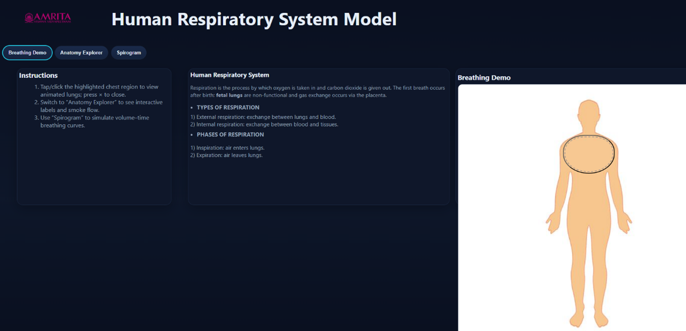
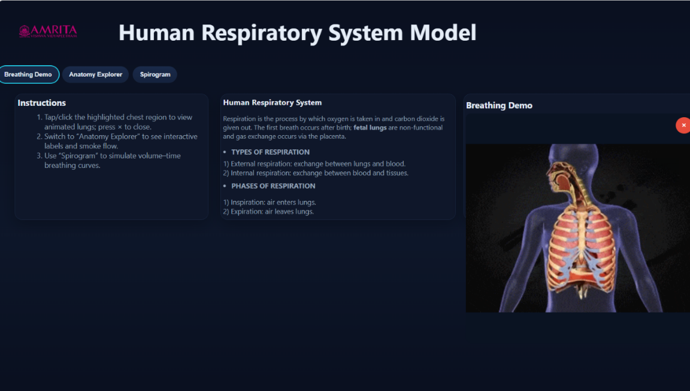
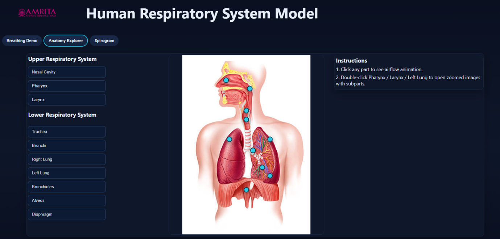
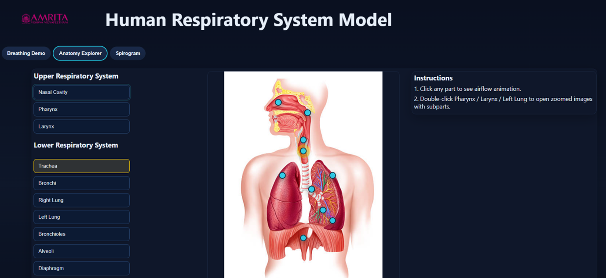
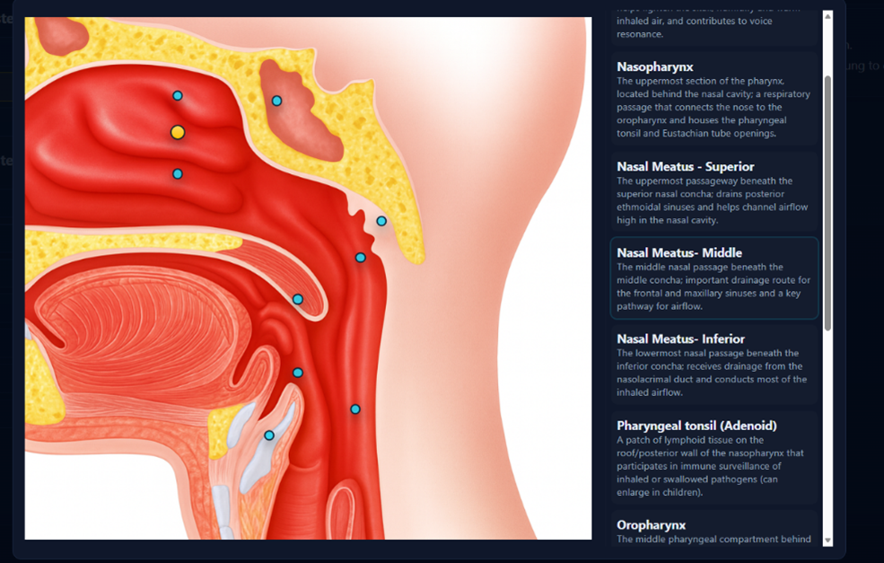
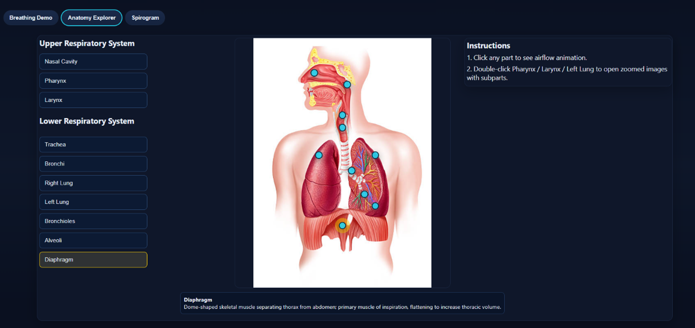
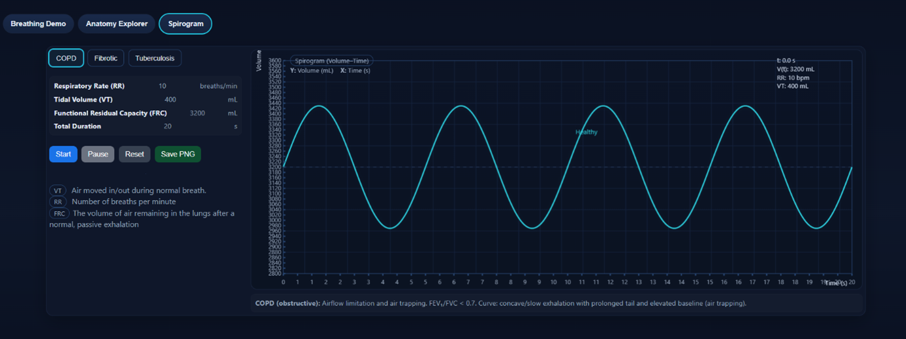
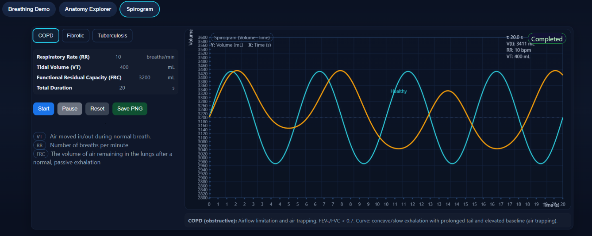
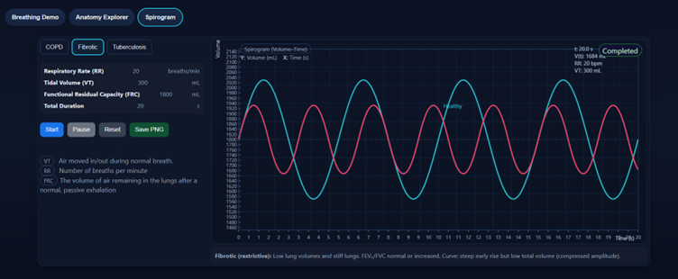
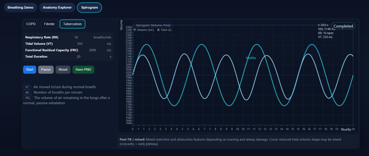

### Steps to work the simulator

1. Users can open the simulator window. The GUI provides different selection tabs such as Breathing Demo, Anatomy Explorer, and Spirogram. Users can be able to switch between these modules by clicking on the respective tabs. The interfaces include a human body model, instructions to perform the simulator, and a brief theory section to support the learning.

  

&nbsp;

&nbsp;

2. In the simulator, user can be able to interact with the breathing demo and understand the mechanical process of respiration. Click on the highlighted chest region of the human model in the GUI to activate the simulation. The lungs expands and contract demonstrating the inhalation and exhalation. Also, the simulator allows the users to stop the animation by clicking on the x button, returning the interface to the default human model view. Thus, the GUI help the users to repeat and observe the breathing cycle multiple times.

  

&nbsp;

&nbsp;

3. User can select the “Anatomy Explorer” tab from the top navigation panel. The interface is provided with an interactive human respiratory system model along with a list of anatomical components categorized into upper and lower respiratory systems.

&nbsp;

4. On the left panel, users can observe two sections: Upper respiratory system which includes nasal cavity, pharynx, larynx and the lower respiratory system with Trachea, bronchi, lungs, bronchioles, alveoli, diaphragm.

  

&nbsp;

&nbsp;

5. Users can be able to select any anatomical structures by click on any structure name (eg. Trachea, Bronchi or left lung) from the list or click directly on the highlighted markers (blue dots) on the interactive human model to visualize the air flow during respiration.

  

&nbsp;

&nbsp;

6. Upon selecting an anatomical structure, the simulator displays airflow animation through that region. Thus, the simulator helps the user to understand the direction of air movement and the sequential flow of air from the upper to lower respiratory tracts.

&nbsp;

7. The simulator also helps the users to explore detailed substructures by double clicking on the specific organs such as pharynx, larynx, left lung. The zoomed in view provides finer anatomical details of the subparts.

  

&nbsp;

&nbsp;

8. User can understand the air conduction pathways in the lower respiratory system like bronchi, bronchioles and alveoli. The animation shows how airflow progress into deeper lung regions where gas exchange occurs.

9. Click on the diaphragm to understand its role in breathing mechanics and user can understand how this structure supports in lung expansion and contraction indirectly.

  

&nbsp;

&nbsp;

10. Users can be able to switch between different structures in the lower and upper respiratory tract to compare the airflow patterns and its roles in the process of respiration.

&nbsp;

11. After exploring all the anatomical structures, users can shift to next tab, “Spirogram” for the quantitative analysis of lung volumes and capacities, including tidal volume, inspiratory and expiratory volumes, and the dynamics of breathing cycles over time.

&nbsp;

12. The interface of spirogram tab provides a parameter control panel on the left side and a volume time graph (spirogram) on the right side and the control buttons for simulation execution.

  

&nbsp;

&nbsp;

13. From the interface, user can select different physiological conditions like COPD, Fibrotic and Tuberculosis. The selection of respective conditions reflects the breathing pattern and lung mechanic in the graph.

&nbsp;

14. The interactive simulator also provides the key parameters like Respiratory Rate (RR) – breaths per minute, Tidal Volume (VT) – air inhaled/exhaled per breath, Functional Residual Capacity (FRC) – air remaining after passive exhalation, Total Duration – simulation time. This GUI provides quantitative insights to the human respiratory function.

&nbsp;

15. The GUI allows the users to review the respiratory parameters from the graph and display such as Respiratory Rate (RR): 10 breaths/min, Tidal Volume (VT): 400 mL, Functional Residual Capacity (FRC): 3200 mL, Total Duration: 20 seconds which defines baseline breathing profile.

&nbsp;

16. User can initiate the simulation by clicking the start button in the GUI and a spirogram graph starts plotting between lung volume(mL) and time(s) dynamically.

&nbsp;

17. Users can observe the breathing cyclic oscillation with an upward curve shows the inhalation and downward curve indicate exhalation. In the graph, peak points represent the maximum lung volume and Troughs indicating minimum lung volume.

&nbsp;

18. For example, in case of disease condition, COPD, when users start the simulation, a graph will plot with lung volume vs time for both healthy condition (blue curve) and the COPD disease condition (orange curve). Users can observe waveform differences in both conditions; healthy curve will be smooth and symmetric cycles while COPD curve will be slower exhalation, elevated baseline, reduced efficiency of airflow.

  

&nbsp;

&nbsp;

19. Users can also observe the breathing patterns for other physiological conditions like Fibrotic (with reduced amplitude with restrictive patterns) and in Tuberculosis conditions showing altered pattern of oscillations depending on the lung involvement. The graphs provide the users to compare the disease curve with healthy reference.

  

&nbsp;

  

&nbsp;

&nbsp;

20. users can also control the simulation using Pause button which stop the graph temporarily, reset button which will clear and restart the simulation, and users can also export the graph for documentation by clicking on “save PNG”

&nbsp;

21. From the spirogram, users can observe how different physiological conditions effect lung volume, breathing efficiency, curve morphology. Save the results, exist and revisit other modules.

