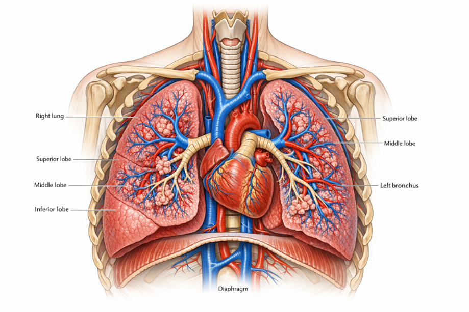
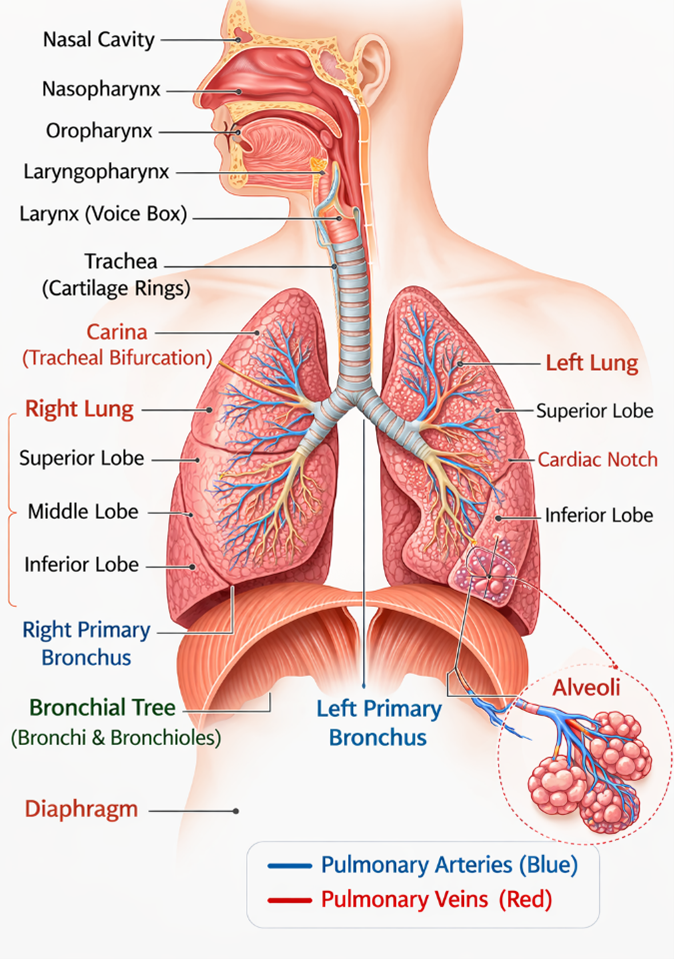

### Introduction
Respiration is the fundamental biological process by which living organisms exchange gases with their environment i.e. taking in oxygen (O2) and eliminating carbon dioxide (CO2) to sustain the life. Oxygen plays a crucial role in cellular respiration, a biochemical process occurring in the mitochondria where nutrients are oxidized to release energy in the form of adenosine triphosphate (ATP) which requires for the growth, repair, movement and overall metabolism. The human respiratory system functions as an integrated unit with specific tissues and organs that responsible for breathing process, the air quality and gas exchanges. It consists of airways, lungs, respiratory muscles and neural control centers which working together in a precise coordination.

The lungs are paired, highly elastic organs located within the thoracic cavity on either side of the mediastinum, which contains the heart and major blood vessels. Structurally, the right lung is divided into three lobes—superior, middle, and inferior—whereas the left lung consists of two lobes and is slightly smaller due to the presence of the cardiac notch that accommodates the heart (Fig.1). Human respiration primarily relies on two fundamental processes: ventilation and diffusion. Ventilation refers to the mechanical movement of air into and out of the lungs, driven by the coordinated contraction and relaxation of respiratory muscles such as the diaphragm and intercostal muscles. Diffusion occurs at the alveolar level, where oxygen moves from the air-filled alveoli into the blood, while carbon dioxide diffuses from the blood into the alveoli. This process is facilitated by the extremely thin alveolar walls, an extensive pulmonary capillary network, and the large surface area of the lungs, all of which contribute to efficient gaseous exchange.

&nbsp;

  
   
  <i>Figure 1. Anatomical illustration of the human respiratory system within the thoracic cavity.
</i>

&nbsp;

### Phases of Respiration 

Respiration occurs in two phases-Inspiration and Expiration. 

During inspiration, inhaled air travels through the conducting airways, including the nasal cavity, pharynx, larynx, trachea, bronchi, and bronchioles, before reaching the alveoli, which are microscopic sacs that function as the primary sites of gas exchange. At the alveolar–capillary membrane, oxygen diffuses into the pulmonary capillary blood and binds to haemoglobin within red blood cells, while carbon dioxide diffuses from the blood into the alveoli to be expelled during expiration. The respiratory system operates in close coordination with the circulatory system, where deoxygenated blood from the right side of the heart is transported to the lungs for oxygenation and oxygen-rich blood is subsequently distributed to tissues and organs throughout the body. In addition, respiratory activity is regulated by neural control centers located in the medulla oblongata, while the lymphatic system contributes to maintaining fluid balance within lung tissues. The immune system further protects the respiratory tract by defending against inhaled pathogens and particulate matter, thereby ensuring efficient gas exchange and maintaining overall physiological homeostasis.

&nbsp;

#### Normal Respiratory Rate at Different Age

•	Newborn: 30 to 60/minute

•	Early childhood: 20 to 40/minute

•	Late childhood: 15 to 25/minute

•	Adult: 12 to 16/minute

&nbsp;

### Structural Organisation of the Respiratory System

Structurally, the human respiratory system is divided into two major regions: the upper respiratory tract and the lower respiratory tract. This division is based on anatomical location and function. The upper respiratory tract is primarily responsible for filtering, warming, and moistening incoming air, while the lower respiratory tract facilitates air conduction and gas exchange. Together, these regions ensure that air reaching the lungs is clean and optimally conditioned for efficient respiration (Fig.2).

&nbsp;
#### Upper Respiratory Tract

**1. Nasal Cavity**

The nasal cavity serves as an entrance for air into the respiratory system. It has two compartments separated by a nasal septum and lined with a mucous membrane containing ciliated epithelial cells. These components are critical in the filtration of air by trapping dust particles, microorganisms, and other foreign substances. Additionally, the nasal cavity warms and humidifies the incoming air through an extensive network of blood vessels and mucus secretion. This conditioning of air is crucial for protecting the delicate structures of the lower respiratory tract and maintaining optimal respiratory function. The nasal cavity also contains olfactory receptors responsible for the sense of smell.

&nbsp;

**2. Pharynx**

The pharynx is a muscular tube that serves as a common passageway for both air and food. It extends from the nasal cavity to the larynx and oesophagus and is divided into three regions: the nasopharynx, oropharynx, and laryngopharynx. The nasopharynx primarily functions as an airway passage, allowing air from the nasal cavity to move toward the lower respiratory tract. The oropharynx serves as a shared pathway for air and ingested food, while the laryngopharynx directs air toward the larynx and food toward the oesophagus. In addition to its role in respiration, the pharynx contributes to immune defense through lymphoid tissues such as the tonsils and assists in swallowing and vocal resonance.

&nbsp;

**3. Larynx**

The larynx, commonly known as the voice box, is located between the pharynx and the trachea. It is composed of several cartilaginous structures that maintain the openness of the airway and protect the respiratory tract during swallowing. The most important components include the thyroid cartilage, cricoid cartilage, and the epiglottis. The epiglottis acts as a protective flap that prevents food and liquids from entering the airway during swallowing by covering the opening of the larynx. Within the larynx are the vocal cords, which vibrate as air passes through them, producing sound and enabling speech. Thus, the larynx plays an essential role in both respiration and phonation.

&nbsp;

  
   
  <i>Figure 2. Anatomical illustration of Upper and lower human respiratory system.
</i>

&nbsp;

#### Lower Respiratory Tract

**1. Trachea**

The trachea, or windpipe, is a flexible tubular structure that connects the larynx to the bronchi. It is supported by a series of C-shaped rings of hyaline cartilage that prevent the airway from collapsing during breathing. The inner lining of the trachea consists of ciliated epithelium and mucus-secreting cells that trap and remove dust particles and pathogens from inhaled air. The coordinated movement of cilia helps propel mucus and trapped particles upward toward the throat, where they can be swallowed or expelled. At its lower end, the trachea divides into two main branches known as the primary bronchi, marking the beginning of the bronchial tree.

&nbsp;

**2. Primary Bronchi**

The primary bronchi are the two main branches that arise from the trachea and conduct air into the lungs. The right primary bronchus is wider, shorter, and more vertical compared to the left bronchus, which makes it more susceptible to the entry of inhaled foreign objects. Each bronchus enters the respective lung and further divides into smaller branches known as secondary or lobar bronchi. These bronchi distribute air to different lobes of the lungs, ensuring that oxygen reaches all regions of the pulmonary tissue. The walls of the bronchi contain cartilage plates and smooth muscle that help maintain airway structure and regulate airflow.

&nbsp;

**3. Bronchial Tree**

Inside the lungs, the bronchi divide repeatedly into smaller tubes forming a complex branching network known as the bronchial tree. The primary bronchi branch into secondary bronchi, which further divide into tertiary bronchi and eventually into bronchioles. Bronchioles are smaller airways that lack cartilage and contain smooth muscle capable of controlling airflow by constriction or dilation. This branching pattern greatly increases the internal surface area of the lungs and ensures efficient distribution of air throughout the pulmonary tissues. The bronchial tree ultimately leads to the terminal bronchioles, which connect to respiratory bronchioles and alveolar ducts.

&nbsp;

**4. Alveoli**

The alveoli are microscopic air sacs located at the ends of the bronchioles and represent the primary sites of gas exchange in the lungs. Each alveolus is surrounded by a dense network of pulmonary capillaries, creating a large surface area for efficient diffusion of gases. The walls of the alveoli are extremely thin, allowing oxygen from inhaled air to diffuse into the bloodstream while carbon dioxide diffuses from the blood into the alveoli to be expelled during exhalation. Alveolar cells also produce a substance known as surfactant, which reduces surface tension and prevents the collapse of alveoli during breathing. The enormous number of alveoli in the lungs provides an extensive surface area necessary for effective respiratory function.

&nbsp;

**5. Lungs**

The lungs are the primary organs of the respiratory system and are located within the thoracic cavity on either side of the mediastinum. They are soft, spongy, and highly elastic structures that expand and contract during breathing. The right lung is divided into three lobes—superior, middle, and inferior—while the left lung has two lobes—superior and inferior—and contains a cardiac notch that accommodates the heart. The lungs contain the bronchial tree, alveoli, blood vessels, and connective tissues that collectively facilitate the exchange of oxygen and carbon dioxide. The outer surface of the lungs is covered by a double-layered membrane known as the pleura, which reduces friction during respiratory movements.

&nbsp;

**6. Diaphragm**

The diaphragm is a dome-shaped skeletal muscle that forms the floor of the thoracic cavity and separates it from the abdominal cavity. It plays a central role in the mechanics of breathing. During inspiration, the diaphragm contracts and moves downward, increasing the volume of the thoracic cavity and creating negative pressure that draws air into the lungs. During expiration, the diaphragm relaxes and returns to its dome-shaped position, decreasing thoracic volume and forcing air out of the lungs. This rhythmic contraction and relaxation of the diaphragm, along with the action of intercostal muscles, enables continuous ventilation of the lungs and efficient gas exchange.

&nbsp;
